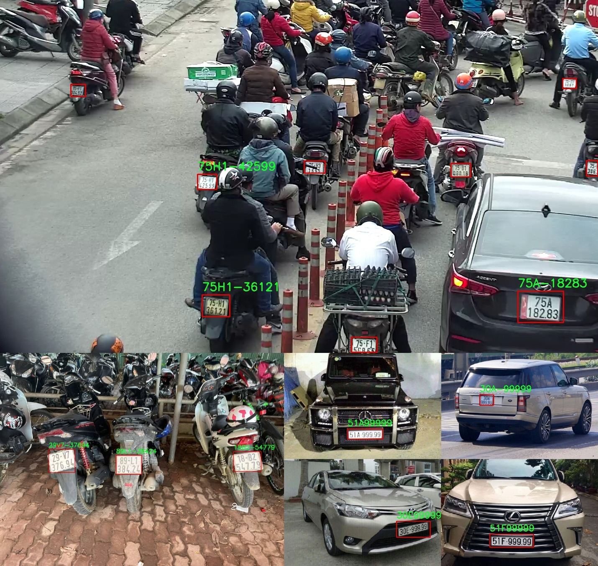

# Vietnamese License Plate Recognition

This repository provides you with a detailed guide on how to training and build a Vietnamese License Plate detection and recognition system. This system can work on 2 types of license plate in Vietnam, 1 line plates and 2 lines plates.

## Installation

```bash
  git clone https://github.com/Marsmallotr/License-Plate-Recognition.git
  cd License-Plate-Recognition

  # install dependencies using pip
  pip install -r ./requirement.txt
```

- **Pretrained model** provided in ./model folder in this repo

- **Download yolov5 (old version) from this link:** [yolov5 - google drive](https://drive.google.com/file/d/1g1u7M4NmWDsMGOppHocgBKjbwtDA-uIu/view?usp=sharing)

- Copy yolov5 folder to project folder

## Run License Plate Recognition

```bash
  # run inference on webcam (15-20fps if there is 1 license plate in scene)
  python webcam.py

  # run inference on image
  python lp_image.py -i test_image/3.jpg

  # run inference on batch of images
  python lp_batch.py -i datasets/plates-picture-dataset -o result/datasets/plates-picture-dataset

  # run LP_recognition.ipynb if you want to know how model work in each step
```

## Gate Control Application (NEW!)

A web-based gate control system for parking management with:

- **Real-time webcam feed** with automatic license plate detection
- **AI-powered OCR** using YOLOv5 for license plate recognition
- **Backend integration** with Spring Boot parking management API
- **Manual override buttons** for security guards
- **Vehicle lookup** with subscription status

### Running the Gate Control App

```bash
  # Start the Gate Control Web App (default port: 8000)
  python gate_control_app.py

  # Or with uvicorn for production
  uvicorn gate_control_app:app --host 0.0.0.0 --port 8000 --reload
```

### Environment Variables

```bash
  # Backend API URL (default: http://localhost:8080/api)
  export BACKEND_API_URL=http://localhost:8080/api

  # Camera index (default: 0)
  export CAMERA_INDEX=0

  # Detection confidence threshold (default: 0.5)
  export CONFIDENCE_THRESHOLD=0.5
```

### Features

1. **A1 - Web Interface**: Modern web UI with real-time camera feed
2. **A2 - AI Detection**: YOLOv5-based license plate detection and OCR
3. **A3 - Backend Communication**: Automatic sync with Spring Boot API
4. **A4 - Manual Override**: Entry/Exit buttons for guards

### Access the Gate Control UI

Open browser at: http://localhost:8000

## LP Recognition API (Flask)

A simple Flask API for license plate recognition:

```bash
  # Start the LP Recognition API (default port: 5000)
  python lp_api.py
```

### API Endpoints

```bash
  # Health check
  GET /health

  # Recognize license plate from image
  POST /recognize
  Content-Type: multipart/form-data
  Body: image (file)
```

## Result




## Vietnamese Plate Dataset

This repo uses 2 sets of data for 2 stage of license plate recognition problem:

- [License Plate Detection Dataset](https://drive.google.com/file/d/1xchPXf7a1r466ngow_W_9bittRqQEf_T/view?usp=sharing)
- [Character Detection Dataset](https://drive.google.com/file/d/1bPux9J0e1mz-_Jssx4XX1-wPGamaS8mI/view?usp=sharing)

Thanks [Mì Ai](https://www.miai.vn/thu-vien-mi-ai/) and [winter2897](https://github.com/winter2897/Real-time-Auto-License-Plate-Recognition-with-Jetson-Nano/blob/main/doc/dataset.md) for sharing a part in this dataset.

## Training

**Training code for Yolov5:**

Use code in ./training folder

```bash
  training/Plate_detection.ipynb     #for LP_Detection
  training/Letter_detection.ipynb    #for Letter_detection
```
